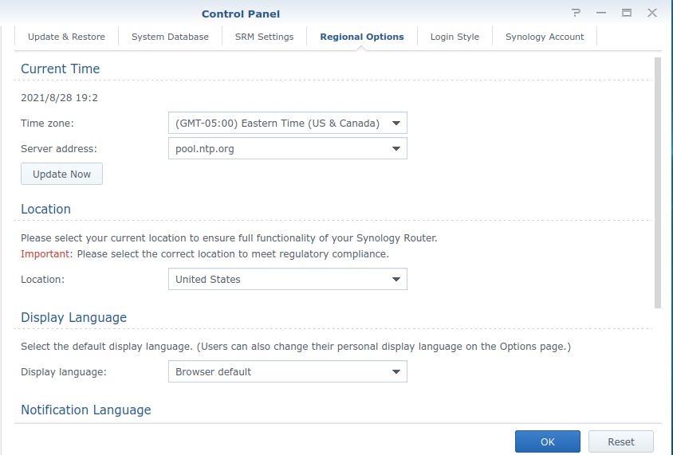

# Limited Connection from  Network

---
---

## Possible Solutions:
---

### <h3 style="color:#02e1f5;">1. Restart Devices</h3>

Sometimes a good reboot is need to clear your cache, any configurations stored in Dynamic memory.

### <h3 style="color:#02e1f5;">2. Check Date and time On Device</h3>

I had the same problem had to a router i reset.  I configured everything correctly except modify the `Date and Time Zone` settings. This caused a `Limited Connection` error message in the router UI. Simply changing the `Date and Time Zone` settings to match your appropriate timezone.

