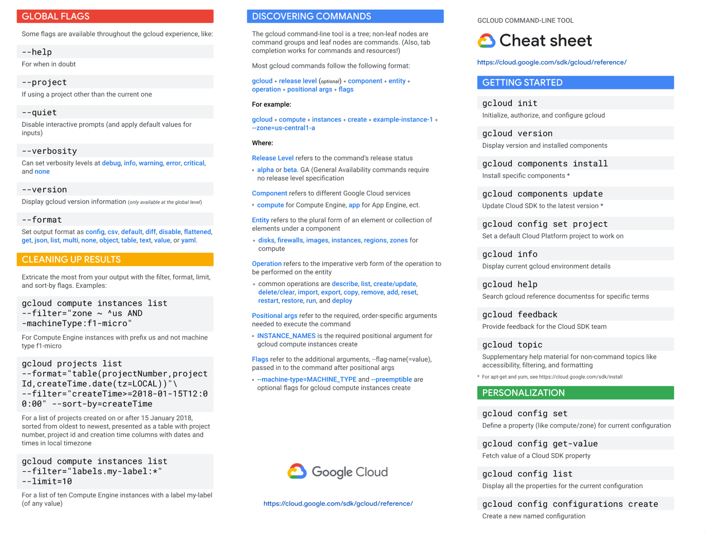
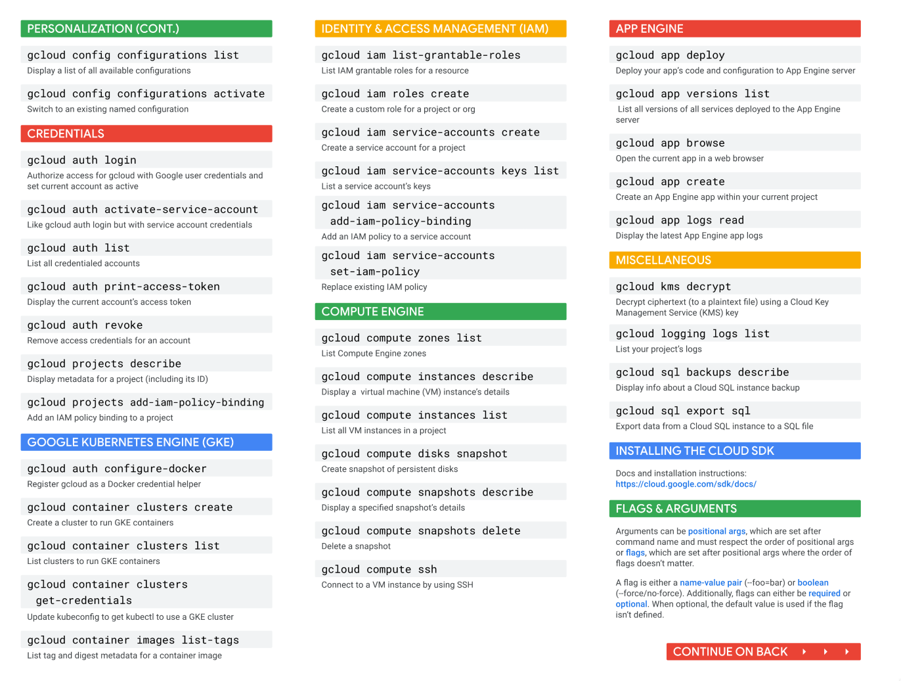

# Cloud SDK: Command Line Interface

## The gcloud command-line tool cheat sheet

A roster of go-to `gcloud` commands for the `gcloud` tool, Google Cloud’s primary command-line tool. See [gcloud-cheatsheet](https://cloud.google.com/sdk/docs/cheatsheet).

(Also included: [introductory primer](#introductory-primer), [understanding commands](#understanding-commands), and a [printable PDF](https://cloud.google.com/sdk/docs/images/gcloud-cheat-sheet.pdf).)

## Cheat sheet

### gcloud cheat sheet poster





### Getting started

Get going with the `gcloud` command-line tool.

- [`gcloud init`](https://cloud.google.com/sdk/gcloud/reference/init): Initialize, authorize, and configure the `gcloud` tool.
- [`gcloud version`](https://cloud.google.com/sdk/gcloud/reference/version): Display version and installed components.
- [`gcloud components install`](https://cloud.google.com/sdk/gcloud/reference/components/install): Install specific components.
- [`gcloud components update`](https://cloud.google.com/sdk/gcloud/reference/components/update): Update your Cloud SDK to the latest version.
- [`gcloud config set project`](https://cloud.google.com/sdk/gcloud/reference/config/set): Set a default Google Cloud project to work on.
- [`gcloud info`](https://cloud.google.com/sdk/gcloud/reference/info): Display current `gcloud` tool environment details.

### Help

Cloud SDK is happy to help.

- [`gcloud help`](https://cloud.google.com/sdk/gcloud/reference/help): Search the `gcloud` tool reference documents for specific terms.
- [`gcloud feedback`](https://cloud.google.com/sdk/gcloud/reference/feedback): Provide feedback for the Cloud SDK team.
- [`gcloud topic`](https://cloud.google.com/sdk/gcloud/reference/topic): Supplementary help material for non-command topics like accessibility, filtering, and formatting.

### Personalization

Make the Cloud SDK your own; personalize your configuration with properties.

- [`gcloud config set`](https://cloud.google.com/sdk/gcloud/reference/config/set): Define a property (like compute/zone) for the current configuration.
- [`gcloud config get-value`](https://cloud.google.com/sdk/gcloud/reference/config/get-value): Fetch value of a Cloud SDK property.
- [`gcloud config list`](https://cloud.google.com/sdk/gcloud/reference/config/list): Display all the properties for the current configuration.
- [`gcloud config configurations create`](https://cloud.google.com/sdk/gcloud/reference/config/configurations/create): Create a new named configuration.
- [`gcloud config configurations list`](https://cloud.google.com/sdk/gcloud/reference/config/configurations/list): Display a list of all available configurations.
- [`gcloud config configurations activate`](https://cloud.google.com/sdk/gcloud/reference/config/configurations/activate): Switch to an existing named configuration.

### Credentials

Grant and revoke authorization to Cloud SDK

- [`gcloud auth login`](https://cloud.google.com/sdk/gcloud/reference/auth/login): Authorize Google Cloud access for the `gcloud` tool with Google user credentials and set current account as active.
- [`gcloud auth activate-service-account`](https://cloud.google.com/sdk/gcloud/reference/auth/activate-service-account): Like `gcloud auth login` but with service account credentials.
- [`gcloud auth list`](https://cloud.google.com/sdk/gcloud/reference/auth/list): List all credentialed accounts.
- [`gcloud auth print-access-token`](https://cloud.google.com/sdk/gcloud/reference/auth/print-access-token): Display the current account's access token.
- [`gcloud auth revoke`](https://cloud.google.com/sdk/gcloud/reference/auth/revoke): Remove access credentials for an account.

### Projects

Manage project access policies

- [`gcloud projects describe`](https://cloud.google.com/sdk/gcloud/reference/projects/describe): Display metadata for a project (including its ID).
- [`gcloud projects add-iam-policy-binding`](https://cloud.google.com/sdk/gcloud/reference/projects/add-iam-policy-binding): Add an IAM policy binding to a specified project.

### Identity & Access Management

Configuring Cloud Identity & Access Management (IAM) preferences and service accounts

- [`gcloud iam list-grantable-roles`](https://cloud.google.com/sdk/gcloud/reference/iam/list-grantable-roles): List IAM grantable roles for a resource.
- [`gcloud iam roles create`](https://cloud.google.com/sdk/gcloud/reference/iam/roles/create): Create a custom role for a project or org.
- [`gcloud iam service-accounts create`](https://cloud.google.com/sdk/gcloud/reference/iam/service-accounts/create): Create a service account for a project.
- [`gcloud iam service-accounts add-iam-policy-binding`](https://cloud.google.com/sdk/gcloud/reference/iam/service-accounts/add-iam-policy-binding): Add an IAM policy binding to a service account.
- [`gcloud iam service-accounts set-iam-policy-binding`](https://cloud.google.com/sdk/gcloud/reference/iam/service-accounts/set-iam-policy-binding): Replace existing IAM policy binding.
- [`gcloud iam service-accounts keys list`](https://cloud.google.com/sdk/gcloud/reference/iam/service-accounts/keys/list): List a service account's keys.

### Docker & Google Kubernetes Engine (GKE)

Manage containerized applications on Kubernetes

- [`gcloud auth configure-docker`](https://cloud.google.com/sdk/gcloud/reference/auth/configure-docker): Register the `gcloud` tool as a Docker credential helper.
- [`gcloud container clusters create`](https://cloud.google.com/sdk/gcloud/reference/container/clusters/create): Create a cluster to run GKE containers.
- [`gcloud container clusters list`](https://cloud.google.com/sdk/gcloud/reference/container/clusters/list): List clusters for running GKE containers.
- [`gcloud container clusters get-credentials`](https://cloud.google.com/sdk/gcloud/reference/container/clusters/get-credentials): Update `kubeconfig` to get `kubectl` to use a GKE cluster.
- [`gcloud container images list-tags`](https://cloud.google.com/sdk/gcloud/reference/container/images/list-tags): List tag and digest metadata for a container image.

### Virtual Machines & Compute Engine

Create, run, and manage VMs on Google infrastructure

- [`gcloud compute zones list`](https://cloud.google.com/sdk/gcloud/reference/compute/zones/list): List Compute Engine zones.
- [`gcloud compute instances describe`](https://cloud.google.com/sdk/gcloud/reference/compute/instances/describe): Display a VM instance's details.
- [`gcloud compute instances list`](https://cloud.google.com/sdk/gcloud/reference/compute/instances/list): List all VM instances in a project.
- [`gcloud compute disks snapshot`](https://cloud.google.com/sdk/gcloud/reference/compute/disks/snapshot): Create snapshot of persistent disks.
- [`gcloud compute snapshots describe`](https://cloud.google.com/sdk/gcloud/reference/compute/snapshots/describe): Display a snapshot's details.
- [`gcloud compute snapshots delete`](https://cloud.google.com/sdk/gcloud/reference/compute/snapshots/delete): Delete a snapshot.
- [`gcloud compute ssh`](https://cloud.google.com/sdk/gcloud/reference/compute/ssh): Connect to a VM instance by using SSH.

### Serverless & App Engine

Build highly scalable applications on a fully managed serverless platform

- [`gcloud app deploy`](https://cloud.google.com/sdk/gcloud/reference/app/deploy): Deploy your app's code and configuration to the App Engine server.
- [`gcloud app versions list`](https://cloud.google.com/sdk/gcloud/reference/app/versions/list): List all versions of all services deployed to the App Engine server.
- [`gcloud app browse`](https://cloud.google.com/sdk/gcloud/reference/app/browse): Open the current app in a web browser.
- [`gcloud app create`](https://cloud.google.com/sdk/gcloud/reference/app/create): Create an App Engine app within your current project.
- [`gcloud app logs read`](https://cloud.google.com/sdk/gcloud/reference/app/logs/read): Display the latest App Engine app logs.

### Miscellaneous

Commands that might come in handy

- [`gcloud kms decrypt`](https://cloud.google.com/sdk/gcloud/reference/kms/decrypt): Decrypt ciphertext (to a plaintext file) using a Cloud Key Management Service (Cloud KMS) key.
- [`gcloud logging logs list`](https://cloud.google.com/sdk/gcloud/reference/logging/logs/list): List your project's logs.
- [`gcloud sql backups describe`](https://cloud.google.com/sdk/gcloud/reference/sql/backups/describe): Display info about a Cloud SQL instance backup.
- [`gcloud sql export sql`](https://cloud.google.com/sdk/gcloud/reference/sql/export/sql): Export data from a Cloud SQL instance to a SQL file.

## Introductory primer

A quick primer for getting started with the gcloud command-line tool.

### Installing the Cloud SDK

Install the Cloud SDK with these [installation instructions](https://cloud.google.com/sdk/docs/).

### Flags, arguments, and other wondrous additions

Arguments can be Positional args or Flags

- **Positional args:** Set after command name; must respect order of positional args.
- **Flags:** Set after positional args; order of flags doesn’t matter.

A flag can be either a:

- *Name-value pair* (`--foo=bar`), or
- *Boolean* (`--force/no-force`).

Additionally, flags can either be:

- *Required*
- *Optional:* in which case, the default value is used, if the flag is not defined

### Global flags

Some flags are available throughout the gcloud command-line tool experience, like:

- [`--help`](https://cloud.google.com/sdk/gcloud/reference#--help): For when in doubt; display detailed help for a command.
- [`--project`](https://cloud.google.com/sdk/gcloud/reference#--project): If using a project other than the current one.
- [`--quiet`](https://cloud.google.com/sdk/gcloud/reference#--quiet): Disabling interactive prompting (and applying default values for inputs).
- [`--verbosity`](https://cloud.google.com/sdk/gcloud/reference#--verbosity): Can set verbosity levels at `debug`, `info`, `warning`, `error`, `critical`, and `none`.
- [`--version`](https://cloud.google.com/sdk/gcloud/reference#--version): Display `gcloud` version information.
- [`--format`](https://cloud.google.com/sdk/gcloud/reference#--format): Set output format as `config`, `csv`, `default`, `diff`, `disable`, `flattened`, `get`, `json`, `list`, `multi`, `none`, `object`, `table`, `text`, `value`, or `yaml`.

### Cleaning up results

Extricate the most from your output with the filter, format, limit, and sort-by flags.

For Compute Engine instances with prefix `us` and not machine type `f1-micro`:

```sh
gcloud compute instances list --filter="zone ~ ^us AND -machineType:f1-micro"
```

For a list of projects created on or after 15 January 2018, sorted from oldest to newest, presented as a table with project number, project id and creation time columns with dates and times in local timezone:

```sh
gcloud projects list --format="table(projectNumber,projectId,createTime.date(tz=LOCAL))" --filter="createTime>=2018-01-15T12:00:00" --sort-by=createTime
```

For a list of ten Compute Engine instances with a label `my-label` (of any value):

```sh
gcloud compute instances list --filter="labels.my-label:*" --limit=10
```

## Understanding commands

The underlying patterns for `gcloud` commands; to aid self-discovery of commands.

### Finding gcloud commands

The gcloud command-line tool is a tree; non-leaf nodes are command groups and leaf nodes are commands. (Also, tab completion works for commands and resources!)

Most gcloud commands follow the following format:

```sh
gcloud + release level (optional) + component + entity + operation + positional args + flags
```

For example:

```sh
gcloud compute instances create example-instance-1 --zone=us-central1-a
```

#### Release level

*Release Level* refers to the command’s release status.

*Example:* `alpha` for alpha commands, `beta` for beta commands, no release level needed for GA commands.

#### Component

*Component* refers to the different Google Cloud services.

*Example:* `compute` for Compute Engine, `app` for App Engine, etc.

#### Entity

*Entity* refers to the plural form of an element or collection of elements under a component.

*Example:* `disks`, `firewalls`, `images`, `instances`, `regions`, `zones` for compute

#### Operation

*Operation* refers to the imperative verb form of the operation to be performed on the entity.

*Example:* Common operations are `describe`, `list`, `create/update`, `delete/clear`, `import`, `export`, `copy`, `remove`, `add`, `reset`, `restart`, `restore`, `run`, and `deploy`.

#### Positional args

*Positional args* refer to the required, order-specific arguments needed to execute the command.

*Example:* `<INSTANCE_NAMES>` is the required positional argument for `gcloud compute instances create`.

#### Flags

*Flags* refer to the additional arguments, `--flag-name(=value)`, passed in to the command after positional args.

*Example:* `--machine-type=<MACHINE_TYPE>` and `--preemptible` are optional flags for `gcloud compute instances create`.
